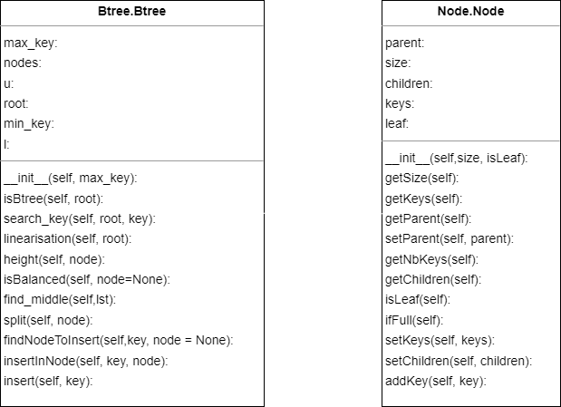

# Projet Btree( Arbre B) L3 Info

## Auteur
- Omar kode Ousmane

## Présentation Objectif du projet
Ce projet consiste en la création d'un `arbre B` (appelé aussi B-arbre par rapport au terme anglais « B-tree ») qui, est une structure de données en arbre équilibré. Contrairement aux noeuds d'un `arbre binaire`, les noeuds d'un arbre B peuvent contenire plusieurs plusieurs `clés` et aussi avoir deux ou plusieurs fils.  
Veuillez accéder à ce lien pour plus de détails : `https://fr.wikipedia.org/wiki/Arbre_B`

Tout au long de ce projet, des fonctions qui vont gérer la recherche, l'insertion, la suppression des noeuds et bien d'autres fonctionnalités seront implémentées.  
Cet arbre sera modélisé en python et deux classes principales seront utiliser pour sa gestion :  
- la classe `Node.py` qui va nous permettre de créer les noeuds  
- la classes `Btree.py` qui va nous permettre de créer un arbre et d'également gérer les méthodes de recherche, de suppression, de modification, etc...

### Livrable 1
- Création d'un fichier `Node.py` pour la création des noeuds et  précisant à la creation si il s'agit d'une feuille ou non
- Création d'un fichier `Btree.py` pour la creation d'un arbre et contient pour l'instant les méthodes principales pour rechercher un noeud dans un arbre, la méthode qui permet de savoir si un arbre est équilibrer ainsi qu'une méthode permettant de linéariser le contenu de l'arbre dans une liste qui doit normalement être triée.
Pour l'instant dans ces fichiers ne permettent que de faire un implémentation plutôt brute d l'arbre.
Un exemple de création d'un arbre b est montrée dans le fichier test `BtreeTest`

### Livrable 2
Pour ce livrable, la fonctionnalité de l'insertion des noeuds dans l'arbre a été implémentée dans le fichier `Btree.py`.
Dans la premiere version de l'implémentation, une seule méthode `insert` a été implémentée pour l'insertion des noeuds dans l'arbre. Mais c'était un peu difficile de gérer l'endroit où insérer les clés dans les noeuds ,gérer les cas où les noeuds sont pleins , la création de nouveaux noeuds, etc... tout cela dans une seule méthode.
Pour cela, j'ai décidé de diviser cette méthode en plusieurs sous-méthodes pour une meilleure gestion de l'insertion des noeuds dans l'arbre.
Dans cette version, j'ai implémenté les méthodes suivantes:
- `split(self, node)` : qui permet de diviser un noeud en deux noeuds et retournant dans une liste la clé mediane qui sera insérée dans le noeud parent ainsi que deux noeuds qui seront les fils du noeud parent et qui contiennent respectivement les clés inférieures et supérieures à la clé mediane.
- `findNodeToInsert(self,key, node)` : qui permet de trouver le noeud où insérer la clé
- `insertInNode(self, key, node)` : qui permet d'insérer la clé dans le noeud
- `insert(self, key)` : qui est la méthode principale pour l'insertion des clés dans l'arbre avec une complexité en O(log(n))

Mis à part cela, j'ai renommé, modifier et ajouter des mothodes de la classe `Node` pour une meilleure compréhension et une meilleure gestion des noeuds. Ce qui a bien évidemment nécessité de modifier les méthodes de la classe `Btree` qui utilisent les méthodes de la classe `Node` pour une meilleure gestion de l'arbre.

## Fonctions principales
Vous trouverez ci-dessous les fonctions principales de la classe `Btree` et `Node`. Pour les autres méthodes, veuillez consulter le diagramme UML et pour plus de détails, veuillez directement consulter le code source de chaque classe.
Cette n'est pas définitive et sera mise à jour au fur et à mesure que le projet avance.

### Btree.py
- `isBalanced(self)`: Vérifie si l'arbre est équilibré. Complexité : `O(n)`
- `search_key(self, key)`: Recherche une clé dans l'arbre. Complexité : `O(log n)`
- `linearisation(self)`: Renvoie une liste triée de toutes les clés dans l'arbre. Complexité : `O(n)`
- `insert(self, key)`: Insère une clé dans l'arbre. Complexité : `O(log n)`

### Node.py
- `getSize(self)`: Renvoie la taille du nœud.
- `getKeys(self)`: Renvoie la liste des clés dans le nœud.
- `getChildren(self)`: Renvoie la liste des enfants du nœud.
- `isLeaf(self)`: Renvoie True si le nœud est une feuille, False sinon.
- `addKey(self, key)`: Ajoute une clé au nœud dans l'ordre trié. Complexité : O(n log n)

## Diagramme UML


## Compilation et exécution

- Compiler d'abord la classe `Node.py` avec la commande suivante:  
``` ···/Btree$ python3 Node.py ```  

- Compiler par la suite la classe `Btree.py` avec la commande suivante:  
``` ···/Btree$ python3 Btree.py ```  
- Compiler par la suite le fichier `BtreeTest.py` pour compiler et exécuter les tests avec la commande suivante:  
``` ···/Btree$ python3 BtreeTest.py ```